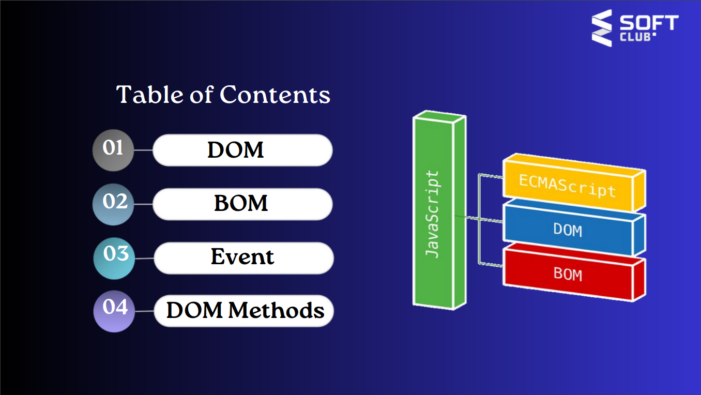

___
___
___
___
___
___

> > > > > 

# The " BOM " meaning it's: ' Browser Object Model '

## The ___BOM___ (Browser Object Model) allows JavaScript to " talk to " the browser 

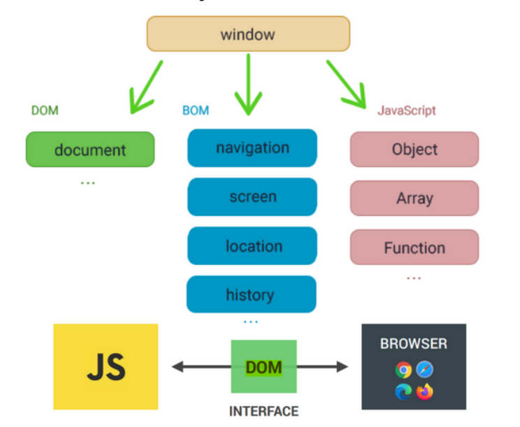

___

> ### The Browser Object Model (BOM) is the additional objects provided by the browser(environment) to work with everything other than the document.
> <br>

___
___
___
___
___
___
___

> > > > > 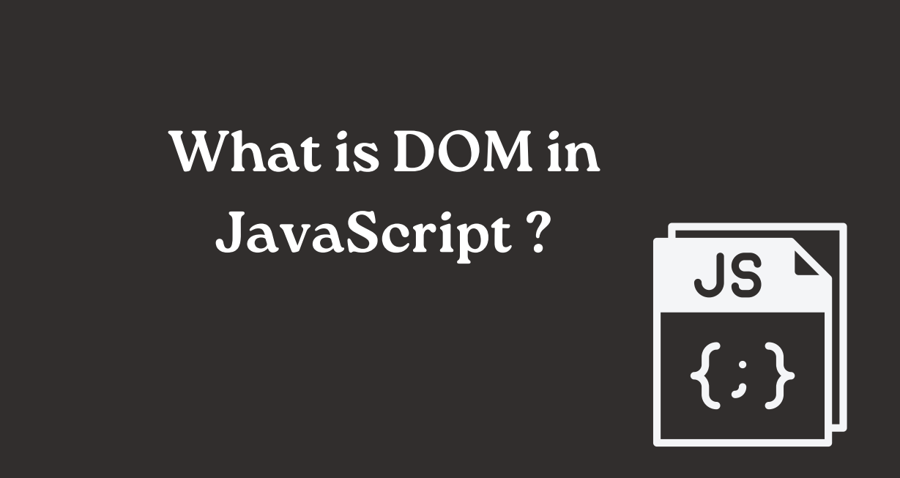
>
# The " DOM " meaning it's: ' Document Object Model '
>

<br>
<br>

> > >
```cpp
DOM - "Document Object Model". It's a standardized way of representing the structure of a document
(such as HTML) as a tree-like structure, where each node represents a part of the document, such as an
element, attribute, text content, etc. DOM allows programs and scripts to access, manipulate, and
update the content, structure, and styles of a web page. JavaScript is commonly used to interact with
the DOM in web development, for tasks such as dynamically changing the content of a page or handling
user events.
```
> > >

<br>
<br>

## ___The DOM data structure is made of nodes, which are related to each other in a hierarchical structure, and each node has a parent node on which it depends, which is the parent node.___

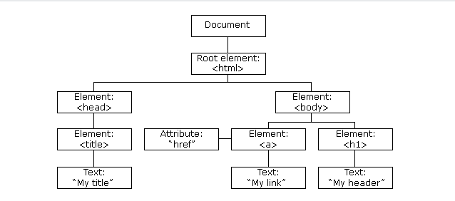


# ___***Dom Features....***___

## ___According to the Document Object Model (DOM for short), every HTML tag is an object. Subtags are "children" of the parent element. The text that is inside the tag is also an object.All these objects are available with JavaScript, we can use them to modify the page.___
<br>
<br>


> ## 1. JavaScript can modify all HTML elements on a page.
> ## 2. JavaScript can change all HTML attributes on a page.
> ## 3. JavaScript can change all CSS style on a page.
> ## 4. JavaScript can removes existing HTML elements and attributes.
> ## 5. JavaScript can add new HTML elements and attributes.
> ## 6. JavaScript can respond to all existing HTML events on the page.
> ## 7. JavaScript can fire new HTML events on a page.

<br>
<br>

## ___Definition and Usage. The querySelector() method returns the first child element that matches a specified CSS selector(s) of an element, querySelectorAll() method can be used to access all elements which match with a specified CSS selector.___

# ___**innerHTML**___ - this property completely provides an easy way replace the elementary element. For example, all requirements the element's body can be removed:

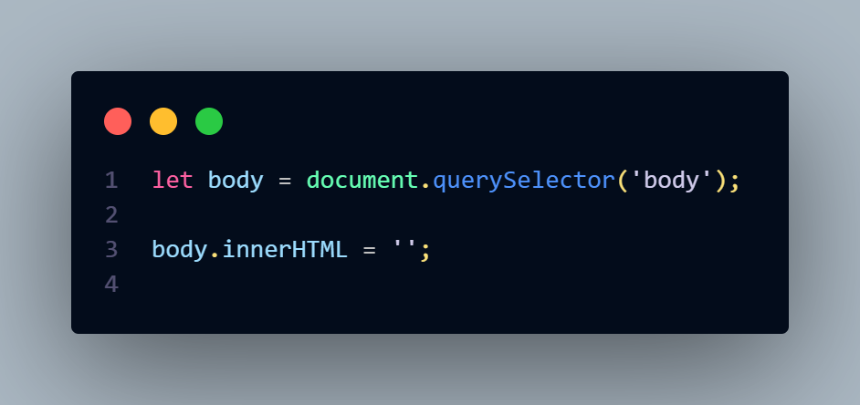

<br>
<br>
<br>

# THe ___**Style**___ object represents an individual style statement.

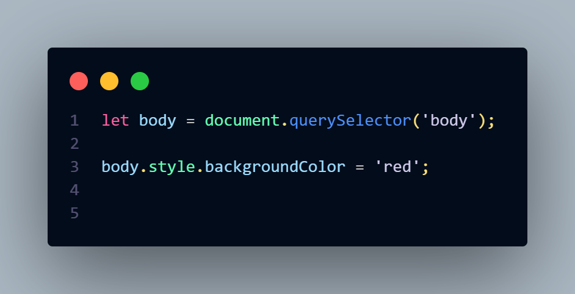

## HTML events are "things" that happen to HTML elements. When JavaScript is used in HTML pages, JavaScript can "react" on these events.

### An HTML event can be something the browser does, or something a user does.

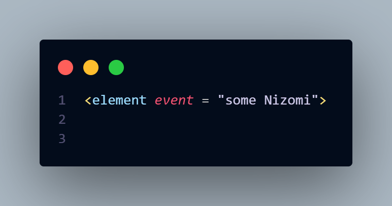

# ___**Here are some examples of HTML events:**___
>1. ### An HTML web page has finished loading
>2. ### An HTML input field was changed
>3. ### An HTML button was clicked

## JavaScript lets you execute code when events are detected.

<br>
_____

# ___onclick___ - The user clicks an HTML element

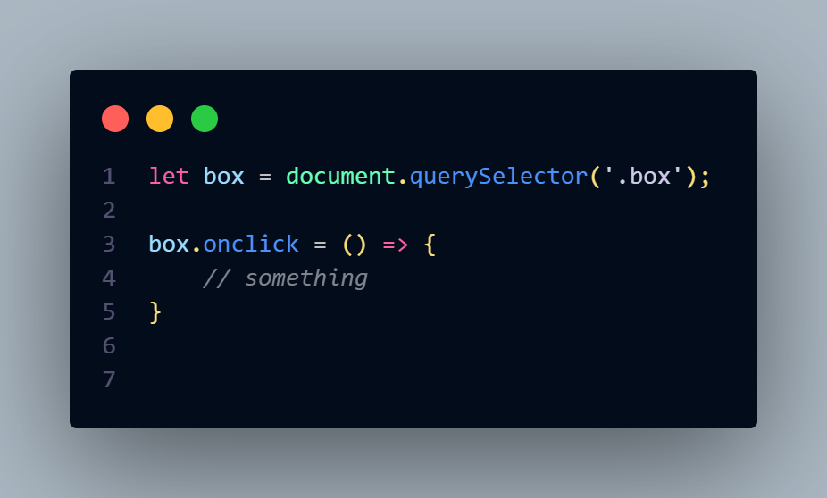

# The JavaScript document.createElement() method allows you to create and return a new element (an empty Element node) with the specified tag name. 1) createElement(elementName): Creates an html element whose tag is passed as a parameter. Returns the created elemen

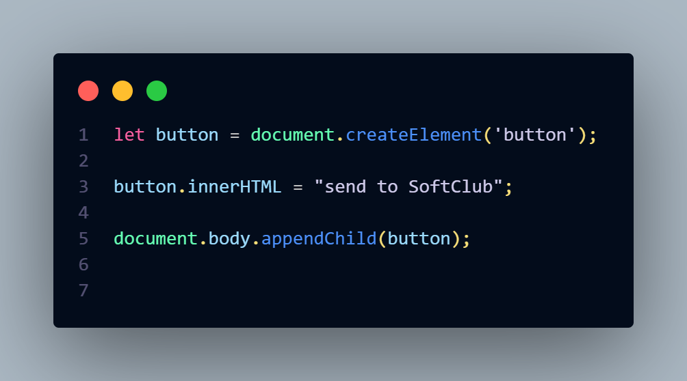

```py
The appendChild() method appends a node
(element) as the last
child of an element.
appendChild() adds a node to the end of the
list of children of the
specified parent node. If the given child
element is a reference to
an existing node in the document, then the
appendChild()
function moves it from its current position to
the new position
```
> Element.classList is a read-only property that contains the current DOMTokenList collection of all the element's class attributes. Using classList provides a more convenient way than accessing an element's class list as a spaceseparated string via element.className.

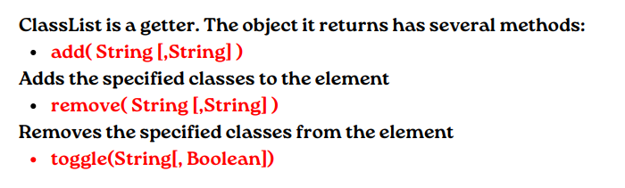

## If the element has no class, it adds it, otherwise it removes it. When false is passed as the second parameter, it removes the specified class, and if true, it adds it. If the second parameter is undefined or a variable with typeof == 'undefined', the behavior is the same as passing only the first parameter when calling

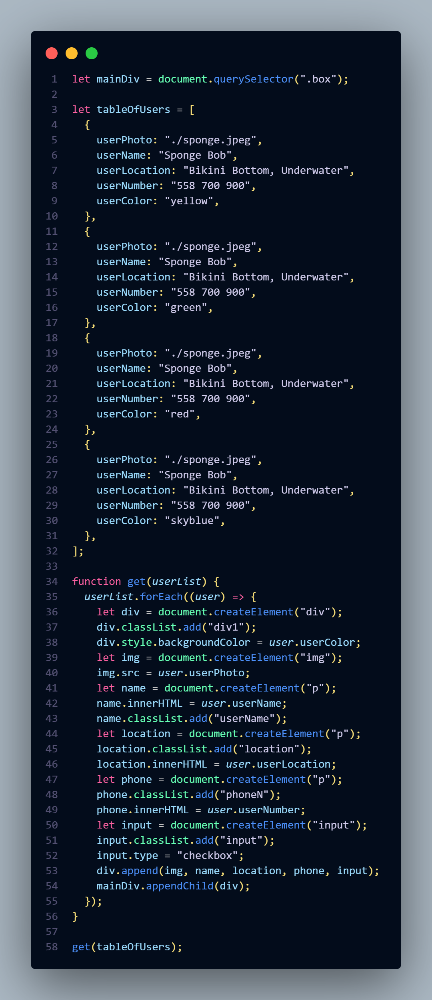

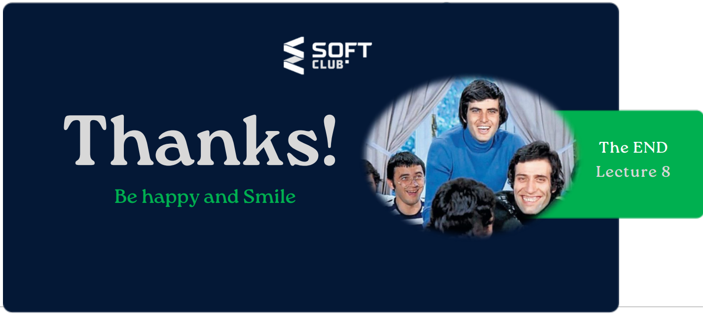